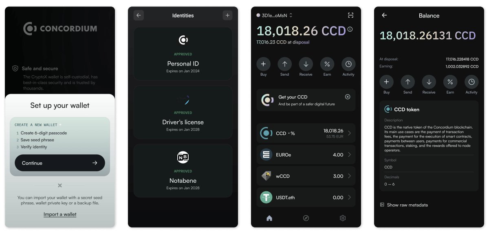

#  Concordium Wallet

Use the Concordium Wallet to get started with the open-source, privacy-centric, public,
and permissionless Concordium Blockchain.
The wallet enables you to create and deploy a privacy-centric digital identity, create and manage accounts on the Concordium Blockchain.

With Concordium Wallet, crypto transactions are finally easy and secure!

- Create digital identities and your initial account via an identity provider (IDP)
- Create additional accounts with your digital identities
- Send and receive CCD
- Check your account balances
- Manage CCD validation and delegation
- Check your CCD release schedule (only for buyers)
- Manage your addresses in the address book for fast and easy transactions
- Export and import backups of your accounts, identities, address book, and keys
- Import both phrase- and file-based wallets simultaneously and switch between them
- Send, receive and view CIS-2 and Protocol-Level tokens
- Connect to Concordium dApps with WalletConnect

[Concordium](https://www.concordium.com/) is a blockchain-based technology project 
that aims to create a decentralized, secure, and scalable platform for business applications. 
It is designed to provide a transparent and compliant blockchain infrastructure with 
built-in identity verification at the protocol level. This makes it suitable for businesses 
and organizations that require a reliable, efficient, and regulatory-compliant blockchain solution.

The Concordium wallet was formerly known as "CryptoX".

## Download
| Mainnet| Testnet|
|:------:|:------:|
|[Google Play](https://play.google.com/store/apps/details?id=com.pioneeringtechventures.wallet&hl=en) &#124; [GitHub](https://github.com/Concordium/cryptox-android/releases/latest)|[Google Play](https://play.google.com/store/apps/details?id=com.pioneeringtechventures.wallet.testnet&hl=en) &#124; [GitHub](https://github.com/Concordium/cryptox-android/releases/latest)|

*APKs attached to GitHub releases have signature different from the packages distributed through GooglePlay, therefore can't be installed over each other without manual uninstall.*

## Development notes

The app requires Java 17 JDK for development.

### Build variants
- Testnet (`tstnet`) – Public Concordium test network, fake funds and identities. Spaceseven stage
- Stagenet (`stagenet`) – Unstable Concordium test network, fake funds and identities.
No Spaceseven instance
- Mainnet (`mainnet`) – Public Concordium network, real funds and identities. Spaceseven production

### Distribution for internal testing
Builds for internal testing tagged as QA (`-qa.X`) are assembled and distributed through Firebase App distribution by the [corresponding pipeline](.github/workflows/firebase_internal_testing.yml).
Update the version in `main`, tag the commit with the version name and push the changes.

[Track the Internal testing pipeline](https://github.com/Concordium/cryptox-android/deployments/Internal%20testing)

APKs can be downloaded from the GitHub workflow artifacts or from the Firebase console.

This project is tested with BrowserStack.

### Building for release
Builds for releases tagged with semver version (`X.Y.Z`) or release candidate (`-rc.X`) 
are assembled by the [corresponding pipeline](.github/workflows/release_build.yml). 
Update the version in `main`, tag the commit with the version name and push the changes.

[Track the Release pipeline](https://github.com/Concordium/cryptox-android/deployments/Releases)

APKs signed for standalone distribution and bundles signed with the Google Play upload key 
can be downloaded from the GitHub workflow artifacts.
