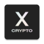

#   CryptoX Concordium Wallet

Use the CryptoX Concordium Wallet to get started with the open-source, privacy-centric and public Concordium Blockchain. 
The wallet enables you to create and deploy a privacy-centric digital identity, create and manage accounts on the Concordium Blockchain.

With CryptoX Wallet, you can: 
- Create digital identities and your initial account via an identity provider (IDP)
- Create additional accounts with your digital identities
- Send and receive CCD, both via regular and shielded transfers
- Check your account balances, both public and private
- Transfer CCD between your balances (from public to private and from private to public)
- Manage CCD baking and delegation
- Check your CCD release schedule (only for buyers)
- Manage your addresses in the address book for fast and easy transactions
- Export and import backups of your accounts, identities, address book, and keys
- Manage CIS-2 tokens
- Connect to Concordium dApps with WalletConnect

## What is Concordium?
[Concordium](https://www.concordium.com/) is a blockchain-based technology project 
that aims to create a decentralized, secure, and scalable platform for business applications. 
It is designed to provide a transparent and compliant blockchain infrastructure with 
built-in identity verification at the protocol level. This makes it suitable for businesses 
and organizations that require a reliable, efficient, and regulatory-compliant blockchain solution.

## What is CryptoX?
CryptoX is a Concordium wallet with an advanced set of features. 
It is based on Concordium reference wallet.

## Download

## Development notes

### Build variants
- Stage – Concordium testnet chain + Spaceseven stage
- Prod – Concordium mainnet chain + Spaceseven prod

### Use Firebase App Distribution for stage builds
1. Place the Firebase JSON config file to `app/secret/firebase-stage.json`
2. Set up a quick runnable Gradle action in Android Studio: 
    - Run: `app:assembleStageRelease app:appDistributionUploadStageRelease`
    - Env variables: `FIREBASE_APP_ID=id-of-the-stage-app` (i.e. `1:000000000000:android:aaaaaaaaaaaaaaaaaaaaaa`)
3. Maintain `app/firebase-releasenotes.txt` to give testers useful context

### Sign app bundle for Google Play
1. Acquire an upload keystore from the company credential storage
2. Build the signed bundle manually
